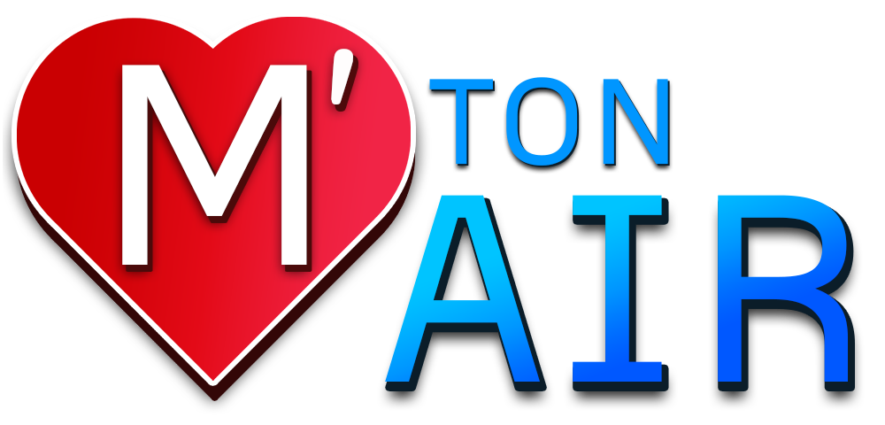

# Server Project

This is the server project, part of the "M' Ton Air" project, which means "Love Your Air" in french. It is a Java Spring Boot API that will provide data concerning Air Quality, all around the world.

## Project structure

